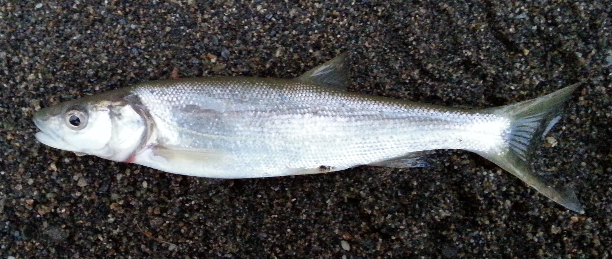
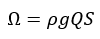
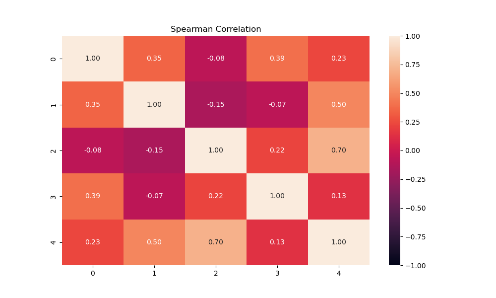
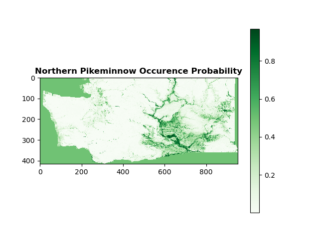

<h1>Northern Pikeminnow Species Distribution Modeling</h1>
<h3>Eric Lagally</h3>
<h3>eric.lagally@gmail.com</h3>
<h3>February 2024</h3>

<h2>Introduction</h2>
The Northern pikeminnow (<i>Ptychocheilus oregonensis</i>) is a freshwater predatory fish native to lakes, streams, and rivers in the Pacific Northwest of the United States. 

Northern pikeminnow is adaptable to a range of environmental conditions, allowing the species to thrive in human-affected ecosystems. In particular, its ability to thrive in the face of hydroelectric projects on rivers has made it a common fish in the Snake and Columbia River systems. This presents a challenge because it preys on salmon fry, and salmon are federally-endangered species. Thus in order to help salmon survive, there have been bounties placed to incentivize fishing for Northern pikeminnow in multiple rivers.

To better understand where pikeminnow are likely to occur as a function of environmental conditions and therefore to predict those locations of highest likelihood of salmon predation, I was interested in comparing a number of species distribution models (SDM) for Northern pikeminnow.

Thanks to the efforts of multiple state and federal agencies, a presence-absence data set is available for multiple fish species, of which Northern pikeminnow is one. This data set is available through the USGS.[1] These data can be combined with presence-only observations from GBIF.[2] Given absence data as a function of geographical location, a variety of statistical and machine learning SDM approaches are possible. In cases where such absence data is not available, other approaches including MaxEnt are possible.[3] Although comparing to presence-only models could provide a validation of the approach, the data set in this study consisted primarily of absence data making the accuracy of such presence-only models very low.

This analysis is based on code from Daniel Fuhrman [4] but extends that work by formatting the data differently, using F1 score instead of other accuracy metrics, and experimenting with different degrees of k-fold cross-validation.

I first imported the USGS dataset and restricted it to just the observations for this species. The species list that is included with the data set indicates that the unique identifier for Northern pikeminnow is 163523. I also imported the few human-observed occurrences for this species from the GBIF dataset.[2] There were only 16 such records in the state of Washington (the rest were preserved specimens).

<h2>Environmental Feature Selection</h2>

The environmental variables required some consideration. I first thought of WorldClim, which provides 19 climatic variables from the years 1970-2000 at a range of different spatial resolutions.[5] However, it was not clear that these climatic variables would be directly related to habitat suitability for fish. For instance, precipitation is important in that it affects stream flow, but the stream flow magnitude will depend on specifics of the stream or river, including valley width, gradient, and stream order. Likewise, air temperature is not directly applicable to aquatic species modeling, but could serve as a proxy for water temperature if these are appropriately correlated.  

Pont <i>et al.</i> used air temperature as a proxy for water temperature and also used thermal amplitude (the difference between minimum and maximum temperatures throughout the year) as a proxy for the thermal variability of oceanic vs. continental climate during the growth periods of fish.[6]. This study also used upstream drainage area and stream power to describe the stream order and size. Other studies point to water velocity, water depth, and sediment size as the variables with the greatest predictive power.[7] Still other research found that the spatial scale under consideration determined which type of environmental variables were most predictive, geographic or hydro-morphological.[8]

What seems clear is that a combination of geographic and hydro-morphological variables together should be considered. Given that I was interested in studying fish occurence across Washington state, I made use of data sets that I knew I could readily assess at a degree of spatial resolution that would provide the strongest modeling outcomes. The NHDPlus dataset from the USGS provides large datasets of stream characteristics, including stream order, stream gradient, stream flow, drainage area, temperature, and elevation.[9]  These are available as vector data sets, which required conversion to raster format. I accomplished this using QGIS, and a PDF document in this repository lists the steps to import the streamlines, collect the relevant fields, and export rasters at appropriate resolutions for downstream analysis.

This study uses stream power, thermal amplitude, mean temperature in July, mean elevation, and drainage area as the environmental features.  Stream power is defined as:

where &rho; is the water density (1000 kg/m3), g is the acceleration due to gravity (9.8 m/s2), Q is the stream flow rate in m3/s, and S is the stream slope. Thermal amplitude was defined as the mean temperature in January subtracted from the mean temperature in July. Drainage area was defined in km2 and all temperatures were in degrees Celsius.

I extracted samples from the raster features that were the same in number as the observations (556). I next checked the covariance of the features with each other to ensure the features were independent. If features were correlated they were unlikely to be correlated linearly. I therefore used Spearman's <i>r</i> instead of the Pearson <i>r</i> to calculate the correlations becasue Spearman's <i>r</i> is a nonparametric correlation coefficient. Several studies used a <i>abs(r)</i> > 0.75 or larger to indicate substantially dependent features, and I use that threshold here as well. [10,11,12]

Based on these results, none of the 5 features were correlated strongly enough with each other to be discarded.

<h2>Model Fitting</h2>

I set all NaNs to 0 for model training purposes. A summary of the observation data revealed that although there are 556 observations in total, the vast majority of these were absences (there are only 61 presence points in the data set). This inbalance of observations makes choosing an accuracy metric especially crucial so as to best reflect the degree of overfitting. The most probable outcome of overfitting would be the model simply predicting all observations as absences. This would result in a 89% "accuracy" but be a terrible classifier. I therefore selected F1 score as my accuracy metric because it is a harmonic blend of precision and recall, commonly used in these conditions. I also split out precision and recall separately to determine which was contributing most strongly to a particular F1 score.[13] Also, based on the limited number of observations, <i>k</i>-fold cross-validation was an important tool to use to avoid overfitting generally.  It was not clear at the outset what the best-performing cross-validation level would be. As such, I tested 3-, 4-, and 5-fold cross validation configurations to determine the effect this had on model performance. 

<h2>Results</h2>

Having trained and fit all the models, the cross-validation scores are shown below:

| Model Name | k | F1 Score | F1 Standard Deviation | Mean Precision | Mean Recall |
|:----------:|:---:|:--------:|:---------------------:|:--------------:|:-----------:|
| Random Forest         | 3 | 0.330481 | 0.155023              | 0.466667       | 0.302233    |
| Extra Trees         | 3 | 0.368210 | 0.123248              | 0.454545       | 0.337321    |
| xgBoost       | 3 | 0.324037 | 0.048669              | 0.342087       | 0.311802    |
| Lightgbm      | 3 | 0.324369 | 0.082827              | 0.346825       | 0.309410    |
| Random Forest         | 4 | 0.235592 | 0.202495              | 0.479532       | 0.222712    |
| Extra Trees         | 4 | 0.313656 | 0.132890              | 0.639517       | 0.266830    |
| xgBoost         | 4 | 0.227970 | 0.134016              | 0.362500       | 0.200490    |
| Lightgbm       | 4 | 0.271660 | 0.133293              | 0.362121       | 0.260784    |
| Random Forest         | 5 | 0.142911 | 0.162121              | 0.177778       | 0.140336    |
| Extra Trees         | 5 | 0.132174 | 0.167752              | 0.175000       | 0.121008    |
| xgBoost        | 5 | 0.182877 | 0.171334              | 0.272500       | 0.152101    |
| Lightgbm       | 5 | 0.200152 | 0.172432              | 0.244211       | 0.202241    |

The best-performing combination of k-fold cross-validation and model was the Extra Trees with 3-fold cross-validation.  It provided the highest F1 score with the lowest variance.  I averaged the outputs for all models using 3-fold cross-validation and the species occurence probability map is shown below.  

After uploading the generated rasters for each model back into QGIS and averaging there, I overlaid the averaged raster with a basemap for geographical reference and that image is below.

<h2>Conclusions</h2>

Based on the F1 scores, these results indicate opportunity for further improvement.  The ideal F1 score is 1, reflecting perfect accuracy and perfect recall.  The F1 scores here are much lower, a reflection of the fact that we have few overall observations and inbalanced numbers of presence and absence observations. The precision and recall are both below 50% across all numbers of cross-validation folds. To increase the F1 score, many more observations would be required, particularly in the presence category. Somewhat ironically, the Northern Pikeminnow Sport-Reward Program keeps detailed statistics on the pikeminnow catch from various points along the Snake and Columbia River watersheds, totalling thousands of fish a month throughout the spring and summer months every year.[14] However, without detailed coordinates of the locations of these fish before they were caught, these data cannot be used in this study. Likewise, the GBIF website shows only 134 observations of northern pikeminnow for Washington state, only 26 of which were a live animal and not a preserved specimen.[2] These 26 observations were included in the study and did increase the balance between presence and absence observations, but only slightly. 

Further work is required to record accurate presence and absence data for Northern pikeminnow to be able to create a more accurate species distribution model for this species in Washington.

However, the consensus occurence map shows larger probability of pikeminnow presence in those areas where we know pikeminnow currently occur (Snake and Columbia rivers), with larger probability also seen in the rivers that feed these main rivers, the Yakima and Spokane rivers especially. Smaller probability of occurence is also observed in some major rivers in western Washington, notably the Snohomish and Skagit, and to a smaller extent the Nisqually, Cowlitz, White, and Puyallup rivers.

Finally, more hyper-parameter tuning could be performed to optimize the performance of the Extra Trees model. Specifically, <i>n_estimators</i> and <i>max_features</i> control the number of trees in the forest and the size of the random subsets of features to consider when splitting a node and are the two main parameters to adjust.[15] However, I did not perform this tuning here because the overall lack of data is more likely to affect model performance compared to hyper-parameter tuning.

<h2>References</h2>

1. [https://www.usgs.gov/data/presence-absence-database-fish-conterminous-united-states](https://www.usgs.gov/data/presence-absence-database-fish-conterminous-united-states)

2. [GBIF.org (16 February 2024) GBIF Occurrence Download https://doi.org/10.15468/dl.sqar36](https://doi.org/10.15468/dl.sqar36) 

3. [https://onlinelibrary.wiley.com/doi/full/10.1111/j.1472-4642.2010.00725.x](https://onlinelibrary.wiley.com/doi/full/10.1111/j.1472-4642.2010.00725.x)

4. [https://daniel-furman.github.io/Python-species-distribution-modeling/](https://daniel-furman.github.io/Python-species-distribution-modeling/)

5. [https://worldclim.org/data/index.html](https://worldclim.org/data/index.html)

6. [https://doi.org/10.1007/s00027-014-0386-z](https://doi.org/10.1007/s00027-014-0386-z)

7. [https://doi.org/10.1007/s00027-015-0413-8](https://doi.org/10.1007/s00027-015-0413-8)

8. [https://doi.org/10.1016/j.ecolmodel.2020.108937](https://doi.org/10.1016/j.ecolmodel.2020.108937)

9. [https://www.epa.gov/waterdata/get-nhdplus-national-hydrography-dataset-plus-data](https://www.epa.gov/waterdata/get-nhdplus-national-hydrography-dataset-plus-data)

10. [https://doi.org/10.1016/j.limno.2013.12.001](https://doi.org/10.1016/j.limno.2013.12.001)

11. [https://doi.org/10.1111/ddi.12086](https://doi.org/10.1111/ddi.12086)

12. [https://doi.org/10.1038/s41598-023-41406-9](https://doi.org/10.1038/s41598-023-41406-9)

13. [https://www.statology.org/f1-score-vs-accuracy/](https://www.statology.org/f1-score-vs-accuracy/)

14. [https://www.pikeminnow.org/](https://www.pikeminnow.org/)

15. [https://scikit-learn.org/stable/modules/ensemble.html#forest](https://scikit-learn.org/stable/modules/ensemble.html#forest)
